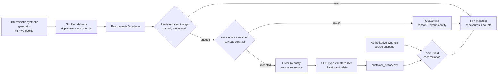

# CDC Lakehouse Reconciliation


A local, dependency-free reference implementation for consuming change data
capture events under duplicate and out-of-order delivery, materializing a
Type 2 slowly changing dimension, quarantining incompatible schemas, and
reconciling active target state to an authoritative source snapshot.

> **Portfolio disclosure:** This is a self-directed demonstration. All people,
> emails, events, identifiers, and metrics are fictional. It is not connected to
> a source database, production lakehouse, or employer system. “Exactly-once
> style” here means idempotent target effects within this local file-backed
> design—not a claim of distributed exactly-once delivery.

## Why this project exists

CDC systems usually fail at the seams: ordering, replay, delete semantics,
contract changes, and proving that the materialized target still agrees with
the source. This project makes those seams explicit and executable:

- deterministic, shuffled CDC deliveries with intentional duplicates;
- per-entity source-sequence ordering;
- a persistent event ledger that prevents replayed target effects;
- INSERT, UPDATE, and DELETE handling in a Type 2 dimension;
- backward-compatible v1 → v2 schema evolution;
- quarantine with machine-readable reasons for incompatible events;
- field-level source-to-target active-state reconciliation; and
- atomic files, checksums, run evidence, tests, CI, and a container.

## Architecture



## Correctness model

| Concern | Mechanism | Evidence |
|---|---|---|
| Duplicate delivery | First occurrence per event ID wins; ledger blocks replay | duplicate and skipped counts |
| Out-of-order delivery | Stable sort by entity, sequence, event time, event ID | SCD2 transition tests |
| Replay | Every accepted or quarantined event is recorded in the ledger | byte-identical target rerun test |
| Stale change | Sequence at or below last applied sequence is quarantined | reason code |
| Schema evolution | v2 may add `loyalty_tier`; unknown versions/fields quarantine | versioned contracts and tests |
| Delete | Current row closes; no replacement current row opens | delete test |
| Target drift | Active source and target keys/fields compare exactly | reconciliation report |
| Partial file visibility | Temporary files are atomically promoted | I/O implementation |

The local ledger and history form a single-process reference. A production
implementation would commit the event offset/ID and Delta table mutation in one
transaction or use an equivalent transactional sink.

## Quick start

Python 3.11+ is the only runtime requirement:

```bash
make demo
make test
```

Or run the phases separately:

```bash
PYTHONPATH=src python3 -m cdc_reconciliation.cli generate \
  --output data/input --seed 20260728 --entities 24

PYTHONPATH=src python3 -m cdc_reconciliation.cli run \
  --events data/input/events.jsonl \
  --source-snapshot data/input/source_snapshot.csv \
  --output warehouse
```

Run the second command again to demonstrate replay safety. The history,
quarantine, and event ledger remain byte-identical; the new run reports zero
newly applied events.

## Reproducible sample

Seed `20260728` with 24 synthetic entities produces:

| Metric | Measured demo value |
|---|---:|
| Delivered events | 47 |
| Unique event IDs | 40 |
| Applied logical events | 38 |
| Duplicate deliveries ignored | 7 |
| Unsupported-schema events quarantined | 2 |
| SCD2 history rows | 36 |
| Active entities | 22 |
| Reconciliation differences | 0 |

The exact result is checked in at
[examples/sample_run_manifest.json](examples/sample_run_manifest.json). These
numbers describe only the synthetic demo.

## State and outputs

```text
warehouse/
├── silver/customer_history.csv        # Type 2 business history
├── quarantine/events.csv              # Invalid/incompatible events
└── _meta/
    ├── event_ledger.csv                # Event outcome ledger
    ├── reconciliation_report.json      # Source/target comparison
    └── run_manifest.json               # Counts and SHA-256 evidence
```

The SCD2 row holds `valid_from`, nullable `valid_to`, `is_current`,
`source_event_id`, and `source_sequence`. Surrogate keys are stable hashes of
entity identity and version start time.

## Interview-defensible trade-offs

- Source sequence is authoritative within an entity; event time is a secondary
  deterministic tie-breaker.
- Events with incompatible schemas are ledgered and quarantined, so replay does
  not generate duplicate quarantine rows.
- The source snapshot deliberately excludes rejected events. Reconciliation
  therefore proves the accepted contract, not silent ingestion of bad data.
- Full-file rewrites make atomicity and test evidence clear at demo scale. A
  production system would use transactional tables, partitioning, checkpoints,
  and bounded incremental reconciliation.
- Deletes close history without emitting tombstone dimension rows. An analytics
  contract needing deletion facts would materialize a separate tombstone stream.

See the [ADR](docs/adr/0001-ledgered-scd2.md) and
[operations runbook](docs/runbook.md) for recovery and production evolution.

## Repository map

```text
src/cdc_reconciliation/  generator, contracts, processor, reconciliation, CLI
tests/                   deterministic, contract, SCD2, replay, delete tests
schemas/                 human-readable v1 and v2 payload contracts
docs/                    ADR and runbook
examples/                reproducible run and reconciliation evidence
.github/workflows/       Python matrix, smoke test, container validation
```

## License

MIT. See [LICENSE](LICENSE).

